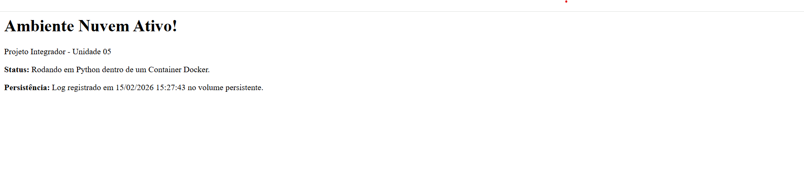

# 🚀 RELATÓRIO TÉCNICO: PROJETO INTEGRADOR – UNIDADE 05

**Disciplina:** ☁️ Computação em Nuvem e Containers  
**Instituição:** Faculdade CDL | Programa: Residência em TIC 2.0 (Capacita iRede / MCTI Futuro)  
**Aluno:** João Lucas Ribeiro Lima Moreira

---

## 📑 Sumário

1. Planejamento da Arquitetura (Tarefa 1)  
2. Preparação do Ambiente com Docker (Tarefa 2)  
3. Simulação de Deploy e Ferramentas (Tarefa 3)  
4. Análise Detalhada: Por que não utilizamos IaaS ou SaaS?  
5. Análise de Conceitos de Nuvem (Tarefa 4)  
6. Segurança, Qualidade e Boas Práticas  
7. Evidências de Execução e Resultados  
8. Conclusão e Resultados  
9. Referências e Acesso ao Projeto  
10. Anexos Técnicos

---

## 🏗️ 1. Planejamento da Arquitetura (Tarefa 1)

O modelo de serviço selecionado para este projeto foi o **PaaS (Platform as a Service)**. Esta escolha fundamenta-se na necessidade de focar no ciclo de vida da aplicação (desenvolvimento e containerização) em detrimento da gestão de infraestrutura de baixo nível. Através do PaaS, garantimos que recursos como elasticidade e alta disponibilidade sejam gerenciados de forma transparente pelo provedor de nuvem.

### 1.1 Objetivo arquitetural

- Construir uma aplicação web simples, confiável e reproduzível.
- Utilizar containerização para garantir portabilidade entre ambientes.
- Simular práticas reais de mercado com deploy automatizado.

### 1.2 Critérios de decisão do modelo de nuvem

Os principais critérios utilizados para escolha do PaaS foram:

- **Tempo de entrega:** acelera o desenvolvimento com menos sobrecarga operacional.
- **Facilidade de manutenção:** permite foco em código e dependências.
- **Padronização de ambiente:** reduz diferenças entre máquina local e execução em nuvem.
- **Escalabilidade gerenciada:** simplifica crescimento da aplicação.

### 1.3 Visão geral da solução

A solução consiste em uma aplicação Flask que responde no endpoint principal e grava logs de acesso em arquivo persistente. O serviço é empacotado em container Docker e pode ser executado localmente ou em ambiente de nuvem com poucas alterações.

---

## 🐳 2. Preparação do Ambiente com Docker (Tarefa 2)

A aplicação foi construída utilizando a imagem oficial `python:3.10-slim`, priorizando leveza e rapidez no build.

### 2.1 Configurações principais

🔌 **Portas:** Exposição da porta `8080` para comunicação externa.  
🌐 **Rede Isolada:** Criação da `rede-projeto` para simular segmentação de tráfego e isolamento de recursos.  
💾 **Volume Persistente:** Implementação de `meu_volume` mapeado para `/app/dados`, assegurando persistência de dados críticos mesmo após reinício do container.

### 2.2 Justificativa técnica da containerização

- Empacota aplicação e dependências em unidade única de execução.
- Reduz problemas de “funciona na minha máquina”.
- Facilita versionamento da infraestrutura junto com o código.
- Permite replicação rápida para validação e homologação.

### 2.3 Fluxo de build e execução

1. Leitura do `Dockerfile` e definição da imagem base.
2. Cópia de `requirements.txt` e instalação de bibliotecas.
3. Cópia dos arquivos da aplicação.
4. Exposição da porta de serviço.
5. Inicialização do processo Python (`app.py`).

### 2.4 Comandos utilizados no ambiente

```bash
# Build da imagem
Docker build -t minha-app-python .

# Criação de rede dedicada (se não existir)
Docker network create rede-projeto

# Criação de volume persistente (se não existir)
Docker volume create meu_volume

# Execução do container com rede e volume
docker run -d -p 8080:8080 --network rede-projeto -v meu_volume:/app/dados minha-app-python
```

---

## 🔄 3. Simulação de Deploy e Ferramentas (Tarefa 3)

A estratégia de entrega adotada foi a **Automatizada (CI/CD)**. Para otimizar o fluxo de trabalho, foi utilizada a extensão oficial **GitHub Actions** integrada diretamente ao VS Code.

### 3.1 Pipeline de automação

🤖 **Automação:** a cada atualização no repositório, o fluxo pode disparar validações e build da imagem Docker.  
📈 **Monitoramento:** a extensão permite acompanhar o status das execuções sem sair do ambiente de desenvolvimento.

### 3.2 Benefícios observados

- Redução de erros humanos em etapas repetitivas.
- Entregas mais previsíveis e rastreáveis.
- Maior confiança para evolução contínua do projeto.
- Centralização do histórico de execução do pipeline.

### 3.3 Exemplo de etapas de workflow (conceitual)

```yaml
name: CI
on: [push]
jobs:
  build:
    runs-on: ubuntu-latest
    steps:
      - uses: actions/checkout@v4
      - name: Build Docker image
        run: docker build -t minha-app-python .
```

---

## 📊 4. Análise Detalhada: Por que não utilizamos IaaS ou SaaS?

### 4.1 Exclusão do modelo IaaS (Infraestrutura como Serviço)

O modelo IaaS oferece elevado nível de controlo, porém exige maior esforço operacional. Neste cenário, a equipe seria responsável por gerenciar sistema operacional, atualizações, configuração de runtime e hardening de infraestrutura.

**Impactos negativos para este projeto:**

- Desvio do foco principal (desenvolvimento da aplicação).
- Maior complexidade para equipe acadêmica em prazo reduzido.
- Custos operacionais e de manutenção mais altos.
- Necessidade de processos adicionais de administração de sistemas.

### 4.2 Exclusão do modelo SaaS (Software como Serviço)

O SaaS foi descartado por não oferecer flexibilidade de infraestrutura e desenvolvimento requerida pela proposta da disciplina. Como usuário final de software pronto, não haveria controle do ciclo de build, containerização e deploy.

**Limitações no contexto do projeto:**

- Ausência de controle sobre código-fonte da solução hospedada.
- Impossibilidade de customizar `Dockerfile` e rede.
- Sem gestão de volume persistente na granularidade necessária.
- Sem esteira CI/CD personalizada para aprendizado prático.

### 4.3 Comparativo resumido

| Modelo | Controle | Esforço operacional | Adequação ao projeto |
|---|---|---|---|
| IaaS | Alto | Alto | Médio |
| PaaS | Equilibrado | Médio/Baixo | **Alto (escolhido)** |
| SaaS | Baixo | Baixo | Baixo |

---

## ☁️ 5. Análise de Conceitos de Nuvem (Tarefa 4)

### 5.1 Escalabilidade e Elasticidade

📈 A containerização permite escalar horizontalmente em cenários de maior tráfego e reduzir instâncias em períodos de baixa demanda. Esse comportamento favorece eficiência de custos e melhor uso de recursos computacionais.

### 5.2 Responsabilidade Compartilhada

🤝 O provedor de nuvem responde pela segurança da infraestrutura física e camada base. A equipe de desenvolvimento responde por:

- Segurança do código Python.
- Atualização de dependências.
- Configuração segura do container.
- Proteção de segredos e variáveis sensíveis.

### 5.3 Disponibilidade e Resiliência

Mesmo sendo um projeto acadêmico de escopo controlado, os princípios de alta disponibilidade podem ser aplicados com:

- múltiplas réplicas do serviço,
- health checks,
- reinício automático,
- armazenamento persistente para logs essenciais.

### 5.4 Observabilidade

A gravação de logs de acesso permite auditoria mínima e visibilidade operacional. Em cenário produtivo, recomendam-se complementos como:

- centralização de logs,
- métricas de latência,
- alertas de indisponibilidade,
- rastreamento distribuído.

---

## 🛡️ 6. Segurança, Qualidade e Boas Práticas

### 6.1 Segurança aplicada no projeto

- Separação de ambiente via container.
- Isolamento de rede para reduzir superfície de exposição.
- Persistência controlada por volume específico.
- Configurações por variáveis de ambiente (`PORT`, `LOG_PATH`).

### 6.2 Qualidade de código e documentação

- Estrutura simples e objetiva no `app.py`.
- Dependências explícitas em `requirements.txt`.
- Instruções de uso em `README.md`.
- Relatório técnico com decisões e justificativas.

### 6.3 Melhorias futuras recomendadas

- Adicionar testes automatizados (unitários e integração).
- Implementar lint e validação estática no pipeline.
- Definir versionamento semântico para releases.
- Incorporar análise de vulnerabilidades em dependências.

---

## 🧪 7. Evidências de Execução e Resultados

### 7.1 Evidências funcionais

- Aplicação executada localmente em `http://127.0.0.1:8080`.
- Endpoint principal respondendo com status de serviço.
- Escrita de log de acesso validada no caminho persistente.

#### 7.1.1 Evidência visual da execução

**Print da aplicação em execução local:**



*Figura 1 — Página inicial da aplicação em execução, comprovando funcionamento do serviço e registro de persistência.*

### 7.2 Evidências de versionamento

- Repositório público atualizado com commits sequenciais.
- Histórico contendo etapas de correção, documentação e publicação.
- Branch principal sincronizada com o remoto.

### 7.3 Indicadores qualitativos

- **Portabilidade:** alta, devido ao uso de Docker.
- **Reprodutibilidade:** alta, com comandos claros de build/run.
- **Manutenibilidade:** boa, dada a estrutura reduzida e direta.

---

## ✅ 8. Conclusão e Resultados

<div style="page-break-after: always;"></div>

A execução deste projeto permitiu validar conceitos fundamentais de computação em nuvem com foco prático em containerização, automação e gestão de ciclo de vida de aplicação. O uso do modelo PaaS mostrou-se adequado por equilibrar produtividade e governança técnica, reduzindo sobrecarga de infraestrutura.

A combinação entre Flask, Docker, versionamento no GitHub e documentação técnica resultou em uma solução objetiva, funcional e didática. O projeto também evidenciou ganhos de rastreabilidade por meio de commits e possibilidade de integração com fluxos CI/CD.

Como próximos passos, recomenda-se evoluir o pipeline com testes automatizados, análises de segurança e práticas adicionais de observabilidade para aproximar ainda mais o ambiente acadêmico de um cenário profissional.

---

## 🔗 9. Referências e Acesso ao Projeto

O código-fonte completo e os fluxos de automação podem ser consultados no repositório público:

🔎 **Link do Repositório:**  
https://github.com/lucasrbmoreira/projetointegrado-irede.git

---

## 📎 10. Anexos Técnicos

### Anexo A — Estrutura de arquivos do projeto

```text
ProjetoIntegrado/
├── app.py
├── Dockerfile
├── requirements.txt
├── README.md
├── relatorio.md
└── relatorio.pdf
```

### Anexo B — Comandos essenciais

```bash
# Criar ambiente virtual
python -m venv .venv

# Ativar ambiente (PowerShell)
.\.venv\Scripts\Activate.ps1

# Instalar dependências
pip install -r requirements.txt

# Executar aplicação
python app.py

# Versionar e publicar
git add .
git commit -m "docs: atualização do relatório"
git push origin main
```

### Anexo C — Checklist de validação

- [x] Aplicação executa localmente
- [x] Container Docker construído com sucesso
- [x] Exposição da porta 8080 validada
- [x] Persistência de logs via volume validada
- [x] Repositório público atualizado
- [x] Relatório técnico atualizado
